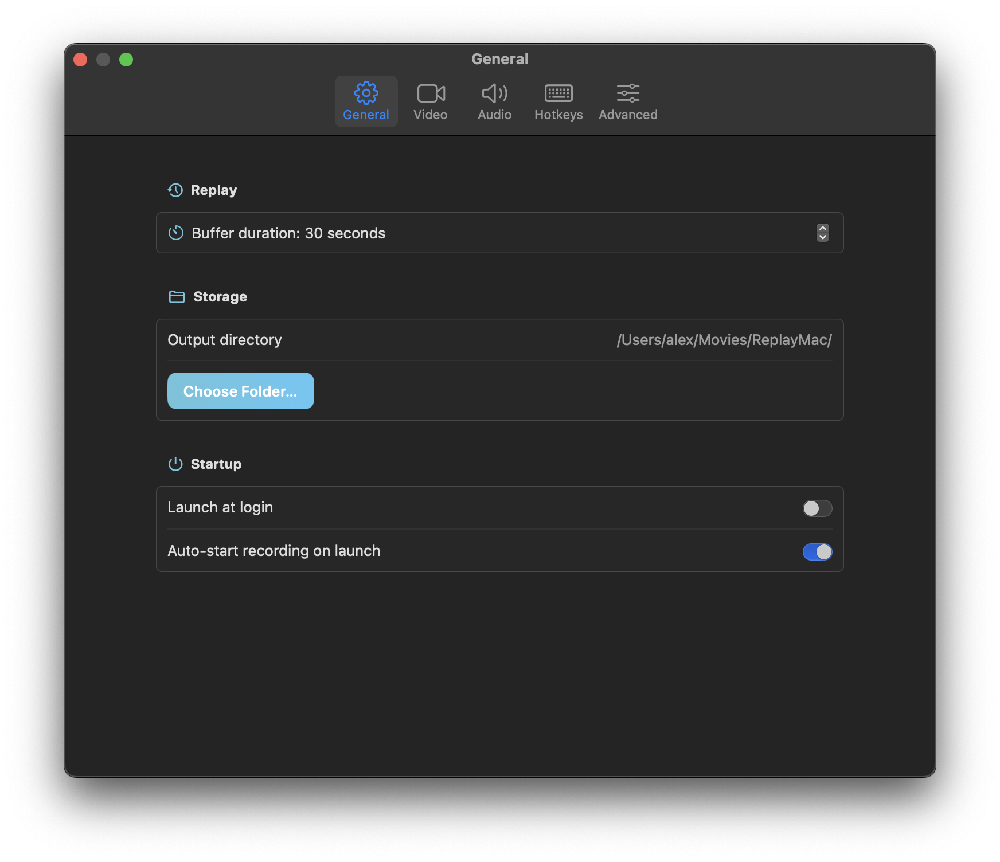
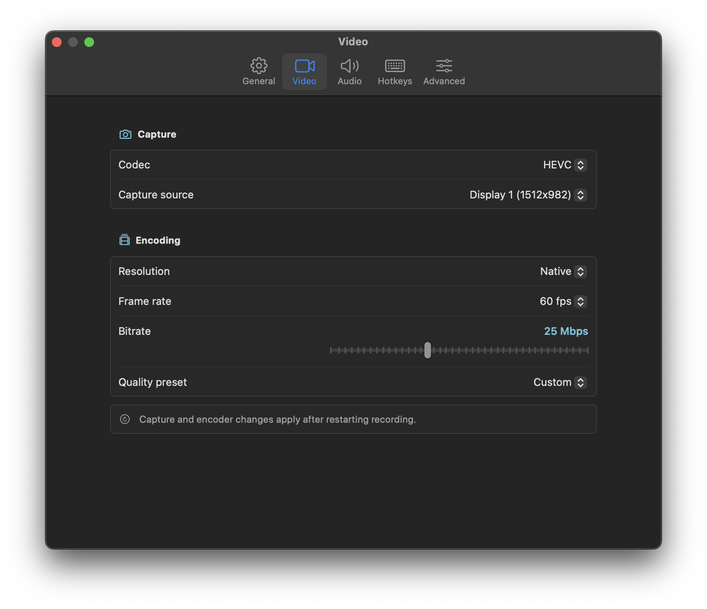
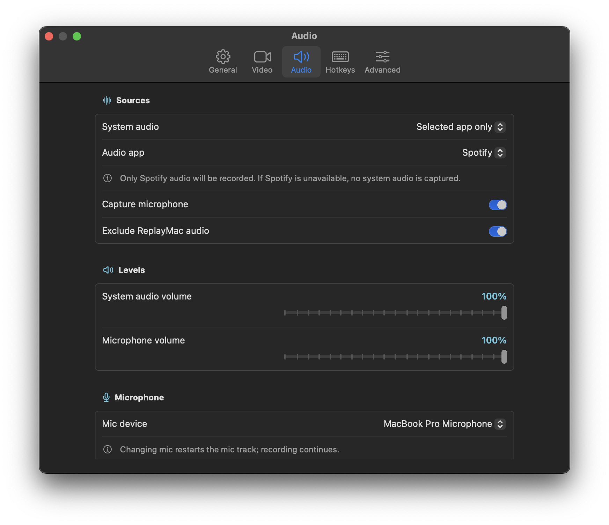
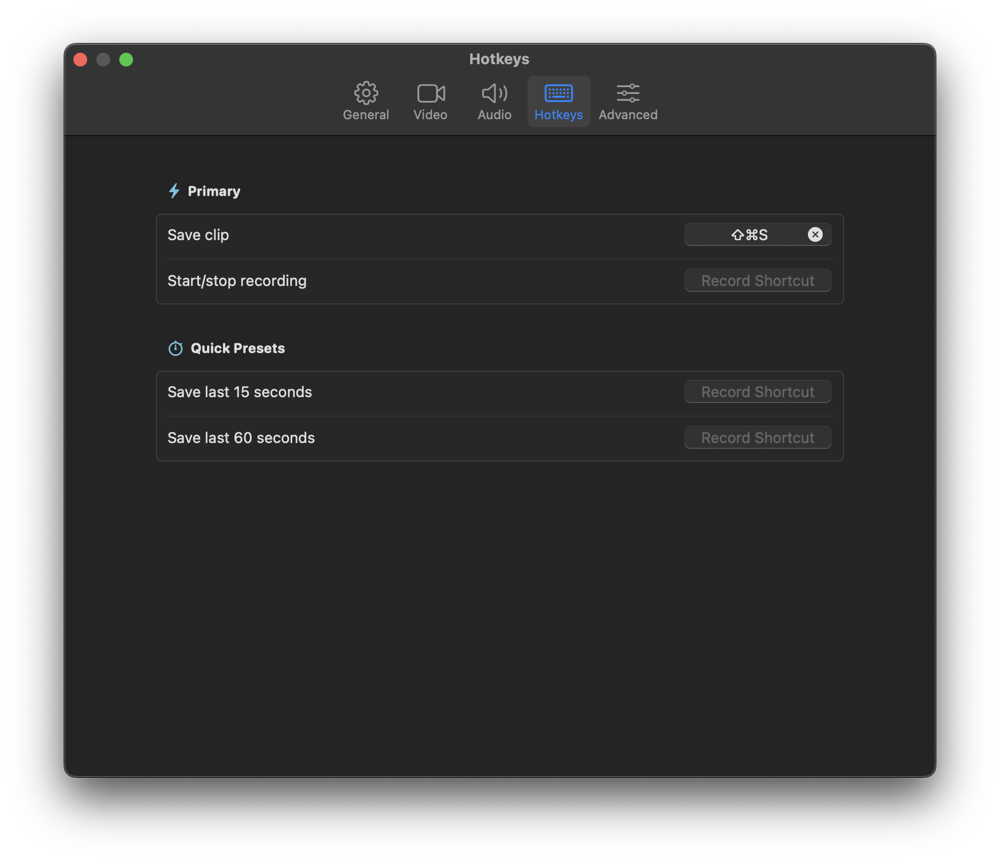
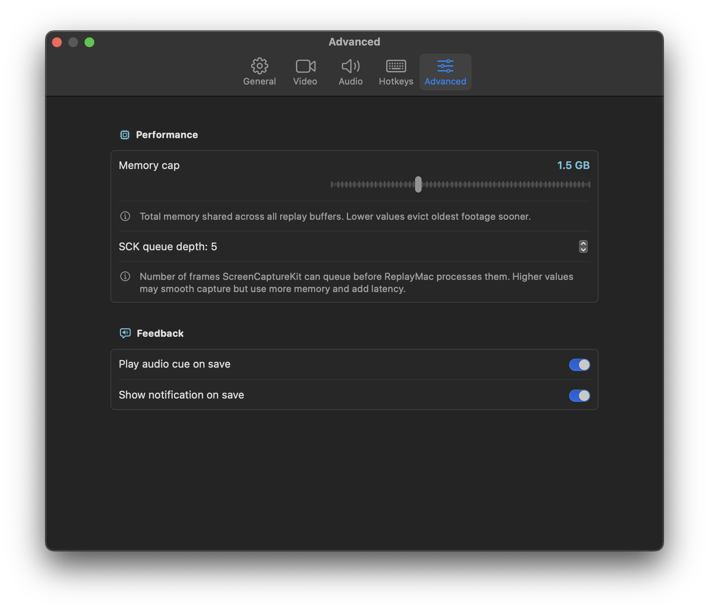
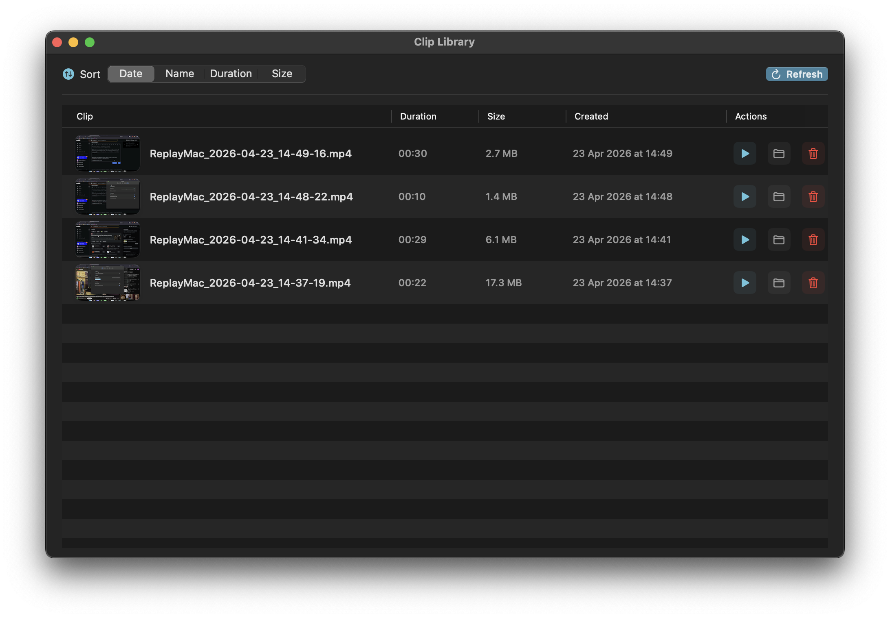

# ReplayMac


ReplayMac is a macOS menu bar instant-replay clipper.

It continuously buffers recent screen/audio capture and saves the last N seconds to an MP4 when triggered.

## Requirements

- macOS 15+
- Swift 6

## Download

Grab the latest release from the [Releases](https://github.com/alex/ReplayMac/releases) page.

> **Note:** ReplayMac is not notarized. On first launch, right-click the app and select **Open** to bypass Gatekeeper.

## Build from source

```bash
./build-app.sh
```

This compiles the app and outputs `dist/ReplayMac.app`.

## Output directory

Saved clips are written to:

`~/Movies/ReplayMac/`

<details>
<summary>Screenshots</summary>








</details>
