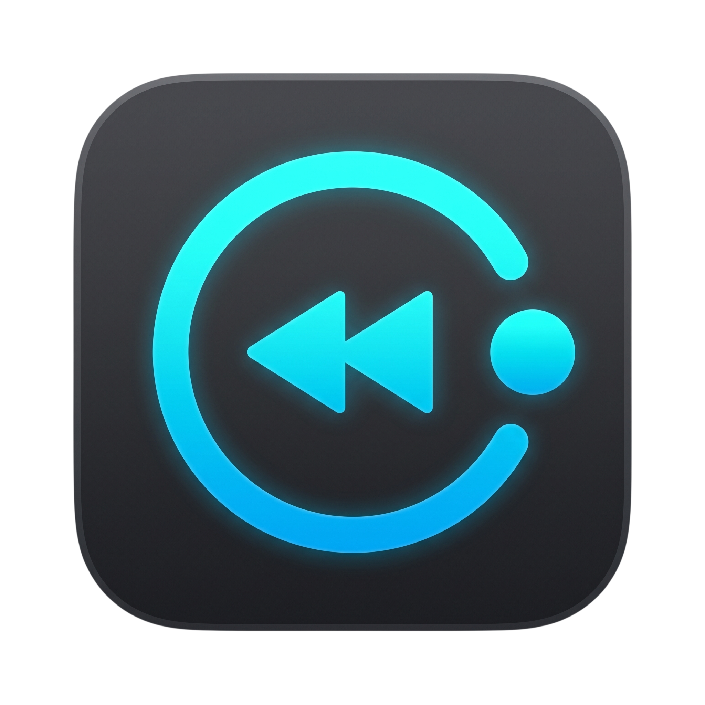

# ReplayMac



ReplayMac is a macOS menu bar instant-replay clipper.

It continuously buffers recent screen/audio capture and saves the last N seconds to an MP4 when triggered.

## Requirements

- macOS 15+
- Swift 6

## Build app bundle

```bash
./scripts/build-app.sh
```

## Package DMG

```bash
./scripts/package-dmg.sh
```

## Output directory

Saved clips are written to:

`~/Movies/ReplayMac/`
