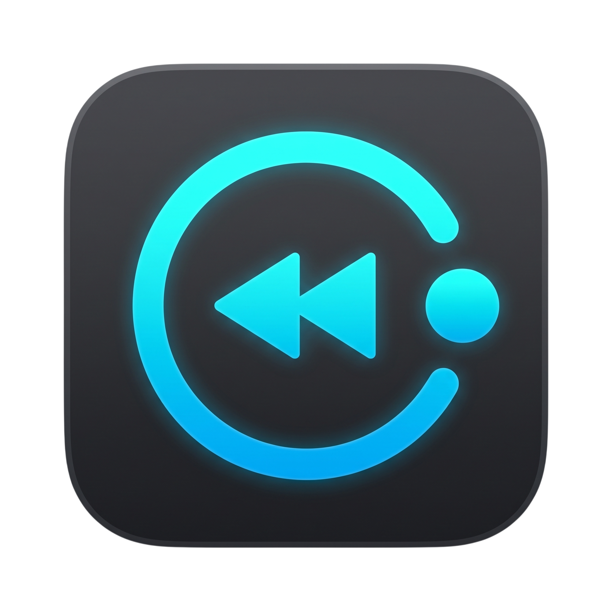

# ReplayMac



[](https://apps.apple.com/us/app/replaycap/id6789296427?mt=12)

> Note: ReplayMac is available on the Mac App Store as **ReplayCap** (same app, different name). It is a one-time purchase that supports development.

ReplayMac is a macOS menu bar instant-replay clipper. It continuously buffers recent screen and audio capture, saving the last N seconds to an MP4 when triggered. Recording and save status stay visible in the menu bar so you always know what the app is doing.

## Features

### Capture & Recording
- **Instant replay and sessions**: Buffer recent activity (15 to 300 seconds) for retroactive saving, or record full sessions directly to MP4.
- **Extended disk buffer**: Roll 5, 10, or 30-minute replay windows to disk when you need longer capture history.
- **Automatic game capture**: Record gameplay automatically based on App Store categories or custom bundle IDs, with launcher exclusions and automatic stop when games exit.
- **Hardware encoding and HDR**: Encode in hardware with HEVC or H.264 via VideoToolbox, with optional 10-bit Rec.2020 HLG HDR capture on Apple silicon.

### Audio & Display Handling
- **Display priority and fallback**: Rank preferred displays in Settings to record the highest-priority connected screen, fall back automatically if disconnected, and re-target your preferred display across reboots, wake, and docking changes.
- **Flexible resolutions and Retina**: Record at native Retina backing-pixel resolution, logical size, half size, or custom dimensions.
- **Dual-display setups**: Capture two monitors as a side-by-side composite or as separate video files, with independent per-display Retina scaling.
- **System audio and microphone**: Capture system sound and microphone together, with options to record selected apps, monitor live level meters, and save audio as separate MP4 tracks.

### Clip Library & Export

Click ReplayMac in the Dock to open **Home** (or the page you choose under Settings > General > Open window to), a control centre with the same actions as the menu bar (save a replay, start or stop the replay buffer or a session, mute the microphone or system audio), live buffer status, each action's hotkey, and the clips you've saved since ReplayMac opened, each with a Trim button. It works well on a second screen. Choose **Clip Library** from the menu bar to browse your clips, or **Settings…** to configure ReplayMac; all three open the same window. The sidebar puts Home and Clip Library above General, Video, Audio, Profiles, Hotkeys and Advanced. Trim & Export opens each clip in its own window, so you can have several edits open at once. Exports run one at a time and keep going if you close the editor, with progress and completion shown in the library.

- **Native appearance**: Liquid Glass navigation and controls on macOS 26+, following your system glass appearance, accent colour, and Light/Dark mode. Earlier macOS versions use native controls.
- **Built-in library and editor**: Preview, trim, and search clips, with support for favorites, tags, notes, and batch actions.
- **Cropping and aspect presets**: Drag a crop box over the preview or snap to 16:9, 1:1, 4:3, or 9:16 for MP4 and GIF exports.
- **Custom exports**: Export with fast passthrough or re-encode to 1080p or 720p with quality presets, HDR metadata preservation, and a live file size estimator.
- **Sharing and disk cleanup**: Share via the macOS share sheet, copy files directly to your clipboard, and clean up older clips by age or library size.

### Workflow & Menu Bar
- **Menu bar controls**: View live recording state, buffer progress, and your latest clip directly from the menu bar.
- **Custom hotkeys**: Trigger instant replays, session recordings, time-specific buffers (15s, 60s), and the clip library with configurable shortcuts.
- **Profiles and templates**: Switch between named capture profiles, tune quality presets, and customize file names using `{app}`, `{date}`, and `{time}` tokens.
- **Live settings and background operation**: Apply capture settings during active recording, launch at login, receive save notifications, and check for GitHub updates.

## Requirements

- macOS 15+
- Apple Silicon or Intel (universal binaries since version 1.6.9)
- Xcode 26 or later to build from source (macOS 26 SDK or later)

## Download

Grab the latest release from the [Releases](https://github.com/picccassso/ReplayMac/releases) page. ReplayMac is notarized by Apple and opens directly on macOS.

> Prefer the App Store? The same app is published there as **[ReplayCap](https://apps.apple.com/us/app/replaycap/id6789296427?mt=12)**, a one-time purchase that helps fund development and updates automatically through the App Store.

## Build from source

```bash
./build-app.sh
```

This compiles the app and outputs `dist/ReplayMac.app`. For local development installs, use:

```bash
./scripts/install-dev.sh
```

That builds and replaces `/Applications/ReplayMac.app` while preserving settings and permissions. To test the complete first-run flow again:

```bash
./scripts/install-dev.sh --fresh
```

Fresh mode clears ReplayMac's onboarding state and cache, resets Screen Recording and Microphone access, preserves saved clips, and leaves the app closed. Add `--launch` when you want it opened after installation, or `--no-build` to install the existing `dist/ReplayMac.app`.

## Output directory

Saved clips are written to `~/Movies/ReplayMac/`.

ReplayMac exports self-contained MP4 files. When audio track separation is enabled, system audio and microphone inputs are stored as distinct audio tracks within the same MP4.

<details>
<summary>Screenshots</summary>

> Screenshots reflect earlier builds and will be updated in an upcoming release.

<table>
  <tr>
    <th width="50%">General</th>
    <th width="50%">Audio</th>
  </tr>
  <tr>
    <td width="50%"></td>
    <td width="50%"></td>
  </tr>
</table>

| Video | Video extended replay |
| --- | --- |
|  |  |

| Profiles | Profile details |
| --- | --- |
|  |  |

| Advanced | Hotkeys |
| --- | --- |
|  |  |

| Clip library | Clip details | Storage cleanup | Batch actions |
| --- | --- | --- | --- |
|  |  |  |  |

</details>

## Troubleshooting

**Shortcut not registering in Settings?** Hotkeys require at least one modifier (⌘, ⌥, or ⌃) unless you use a function key (F1–F12) on its own. You can also configure hotkeys directly from the Terminal: see [Setting ReplayMac Hotkeys from the Terminal](docs/manual-hotkey-setup.md).

## Support

If you like ReplayMac and want to support its development, consider leaving a tip on [Ko-fi](https://ko-fi.com/picccassso). 🙂

## License

ReplayMac is free and source-available.

You may download, use, inspect, build, and modify it for personal use. Redistributing modified builds, publishing renamed forks, commercial sales, and using ReplayMac branding require permission.

See [LICENSE.md](LICENSE.md).
